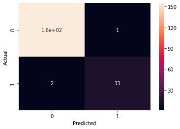

# Analysis of PKDD'99 Dataset

Analysis of PKDD'99 Dataset in order to predict who will default on loan.

Goal of this notebook was to practice SQL queries for feature engineering instead of predominantly using pandas. Using Random Forest classifier, an f1-score of 0.9 was acheieved in predicting those who will default which is reasonable considring the imbalance in classes

